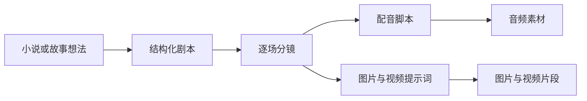

<div align="center">

# 🎬 manju-tool

### 把小说或一个故事想法，整理成可继续制作的 AI 漫剧素材

剧本 · 分镜表 · 配音脚本 · 图片 · 视频提示词 · 视频片段

[](https://www.python.org/)
[](#)
[](LICENSE)
[](#验证与文档)

**适合小说作者、短视频创作者、编剧和 AI 内容制作团队。**

</div>

---

## 🌟 它能帮你做什么？

你可以从一篇小说、一个现成剧本，甚至一句故事想法开始。工具会把内容逐步整理成后续制作需要的文件。



| 你提供 | 工具可以生成 |
|---|---|
| 小说文本 | 人物、场景、对白和结构化剧本 |
| 一个故事想法 | 完整剧本和场景安排 |
| 剧本 | 分镜表、画面描述、对白、音效和提示词 |
| 分镜 | 配音脚本、音频、视频提示词和可选素材 |

> [!TIP]
> 第一次使用时，推荐从 `manju pipeline --novel "你的小说.txt"` 开始。它会按顺序完成剧本整理、分镜、配音脚本和视频提示词。

> [!NOTE]
> `pipeline` 的定位是“制作素材流水线”。最终成片中的字幕样式、转场、混音、调色和时间线剪辑，继续在你熟悉的后期环境中完成。

---

## 🚀 零基础快速开始

整个过程分为四步：

1. 安装 Python
2. 下载并安装本工具
3. 填写 API 配置
4. 运行第一条命令

### 第一步：准备 Python

需要 Python 3.10 或更高版本。

打开终端后输入：

```bash
python --version
```

看到类似 `Python 3.10.11`、`Python 3.11.x` 或 `Python 3.12.x`，即可继续。

<details>
<summary><strong>Windows 提示：终端在哪里？</strong></summary>

1. 打开解压后的 `manju-tool` 文件夹。
2. 点击文件夹顶部的地址栏。
3. 输入 `powershell`，按回车。
4. 新窗口会自动定位到当前文件夹。

如果系统还没有 Python，可从 Python 官方网站安装。安装界面中勾选将 Python 加入 PATH 的选项，后续命令会更顺畅。

</details>

### 第二步：下载并安装

#### 方法 A：下载 ZIP，适合第一次接触代码仓库的用户

1. 点击 GitHub 页面右上区域的 **Code**。
2. 选择 **Download ZIP**。
3. 解压下载文件。
4. 在解压后的 `manju-tool` 文件夹中打开终端。
5. 运行：

```bash
python -m pip install -e .
```

#### 方法 B：使用 Git

```bash
git clone https://github.com/Bowen-studying/manju-tool.git
cd manju-tool
python -m pip install -e .
```

安装完成后检查命令：

```bash
manju --help
```

如果终端找不到 `manju`，可以使用同等写法：

```bash
python -m manju.cli --help
```

### 第三步：填写 API 配置

API 可以理解为“让本工具调用 AI 能力的连接信息”。最少需要一组文字模型配置，用于整理剧本、生成分镜和分析对白。

在个人主目录创建名为 `.manju.env` 的文本文件：

- Windows：`C:\Users\你的用户名\.manju.env`
- macOS / Linux：`~/.manju.env`

Windows 可以直接运行：

```powershell
notepad $HOME\.manju.env
```

将下面内容复制进去，再把示例值替换成你自己的信息：

```env
# 文字模型：基础流程必填
LLM_API_KEY=your-key
LLM_API_BASE=https://your-api.example.com/v1
LLM_MODEL=your-model-name

# 图片生成：使用 --image-api 时填写
MANJU_IMAGE_API_KEY=your-key
MANJU_IMAGE_API_BASE=https://your-api.example.com/v1
MANJU_IMAGE_MODEL=your-model-name

# 视频生成：使用 --render-videos 或 generate 时填写
MANJU_VIDEO_API_KEY=your-key
MANJU_VIDEO_API_BASE=https://your-api.example.com/v1
MANJU_VIDEO_MODEL=your-model-name

# 自选语音服务：可选
MANJU_VOICE_API_KEY=your-key
MANJU_VOICE_API_BASE=https://your-api.example.com/v1
MANJU_VOICE_MODEL=your-model-name
```

所有地址均可填写 API 根地址，工具会自动补全常见请求路径。也可以直接填写完整接口地址。

> [!IMPORTANT]
> 小说、提示词和参考素材会发送给配置的第三方服务。处理未公开内容前，请先确认服务商的数据保留与隐私政策。

> [!WARNING]
> 文字、图片、语音和视频服务可能分别计费。逐镜视频生成默认关闭，只有显式加入 `--render-videos` 才会调用视频生成服务。

### 第四步：完成第一次运行

准备一个 UTF-8 编码的小说文本，例如 `我的小说.txt`，放在当前文件夹中，然后运行：

```bash
manju pipeline --novel "我的小说.txt"
```

运行结束后，终端会显示输出位置。默认输出通常位于当前文件夹中的：

```text
manju-output/
└── 日期_时间/
    ├── storyboard/
    │   ├── storyboard.json
    │   ├── storyboard.md
    │   └── storyboard.xlsx
    ├── voice_scripts.pdf
    ├── video_prompts.pdf
    └── 使用指南.pdf
```

如果运行中断，再次执行同一条命令即可从已完成阶段继续：

```bash
manju pipeline --novel "我的小说.txt" --resume
```

---

## 🧭 按你的起点选择命令

### 我有一篇小说

```bash
manju pipeline --novel "小说.txt"
```

适合希望一次得到剧本、分镜、配音脚本和视频提示词的用户。

### 我已经有结构化剧本

```bash
manju pipeline --script "剧本.json"
```

工具会从分镜阶段继续。

### 我已经有分镜

```bash
manju pipeline --storyboard-json "storyboard.json"
```

工具会直接生成配音脚本和视频提示词。

### 我只有一个故事想法

```bash
manju pipeline
```

终端会逐项询问剧名、类型、主角和核心冲突。填写完成后自动进入后续流程。

### 我只想完成其中一步

| 目标 | 命令示例 |
|---|---|
| 小说整理成剧本 | `manju adapt "小说.txt"` |
| 从想法创作剧本 | `manju create` |
| 剧本生成分镜 | `manju storyboard "剧本.json"` |
| 分镜生成配音脚本 | `manju voice "storyboard.json"` |
| 分镜生成视频提示词 | `manju video "storyboard.json"` |
| 一段文字生成图片 | `manju image "画面描述"` |
| 一段文字生成视频 | `manju generate "动作和画面描述"` |
| 一段文字生成语音 | `manju speak "需要朗读的文字"` |

---

## 🎨 生成图片和视频素材

### 生成单张图片

```bash
manju image "雨夜古城，少女撑伞回望，电影感光影"
```

使用本地参考图：

```bash
manju image "保持人物特征，改为转身回眸" -i "reference.png"
```

指定尺寸和文件名：

```bash
manju image "雪山木屋，窗内暖光" --size 1024x768 -n "scene_01"
```

### 批量生成图片

创建 `prompts.txt`，每行写一个画面描述：

```text
古城城门，清晨薄雾
同一角色走入长街
同一角色停在茶楼门前
```

运行：

```bash
manju image --batch "prompts.txt"
```

### 直接生成视频片段

```bash
manju generate "雪夜森林，一匹白马缓慢走过，镜头平稳跟随"
```

使用参考图：

```bash
manju generate "人物缓慢抬头，眼神逐渐坚定" -i "reference.jpg"
```

### 在完整流程中生成素材

加入图片、配音音频和逐镜视频：

```bash
manju pipeline --novel "小说.txt" --image-api --speak --render-videos
```

其中逐镜视频通常耗时更长，也可能产生较高费用。可以先运行基础流程，确认分镜后再生成素材。

---

## 🎙️ 配音怎么使用？

只生成配音脚本：

```bash
manju voice "storyboard.json"
```

同时生成音频：

```bash
manju voice "storyboard.json" --speak
```

单独朗读一段文字：

```bash
manju speak "欢迎来到今天的故事"
```

调整语速、声调和音量：

```bash
manju speak "快跑！" --speed 1.4 --pitch 7 --volume 8
```

分镜配音会结合上下文推断情绪，并为不同角色稳定分配音色。无对白镜头也会保留在配音表中，便于和分镜逐行核对。

---

## 📦 你会得到哪些文件？

| 文件 | 打开方式 | 用途 |
|---|---|---|
| `*_script.json` | 文本编辑器 | 结构化剧本，供后续命令读取 |
| `storyboard.xlsx` | 表格软件 | 查看和修改逐镜内容 |
| `storyboard.md` | 文本编辑器 | 快速浏览分镜 |
| `storyboard.json` | 文本编辑器 | 项目的主要状态文件 |
| `voice_scripts.pdf` | PDF 阅读器 | 配音顺序、角色、台词和情绪参数 |
| `video_prompts.pdf` | PDF 阅读器 | 每个镜头的中英文视频提示词 |
| `audio/` | 音频播放器 | 生成的配音文件 |
| `images/` | 图片查看器 | 生成的镜头图片 |
| `videos/` | 视频播放器 | 生成的视频片段 |
| `使用指南.pdf` | PDF 阅读器 | 本次输出的后续制作流程 |

`storyboard.json`、阶段目录和 `.manju.json` 元数据共同支持续跑与缓存。继续制作期间，建议保留它们。

---

## 🧩 常用选项

| 选项 | 含义 |
|---|---|
| `-o 路径` | 指定输出文件夹 |
| `--resume` | 复用已完成阶段和未变化素材 |
| `--max-scenes 数量` | 指定目标场景数 |
| `--image-api` | 在分镜阶段调用图片生成服务 |
| `--speak` | 生成配音音频 |
| `--render-videos` | 按镜头生成视频片段 |
| `-i 图片路径` | 给图片或视频生成提供参考图 |
| `--batch 文件` | 从文本文件批量读取内容 |

查看任意命令的完整选项：

```bash
manju pipeline --help
manju storyboard --help
manju image --help
```

---

## 🩺 常见问题

<details>
<summary><strong>终端提示找不到 manju</strong></summary>

先确认安装命令执行成功：

```bash
python -m pip install -e .
```

随后可以用模块方式运行：

```bash
python -m manju.cli --help
python -m manju.cli pipeline --novel "小说.txt"
```

</details>

<details>
<summary><strong>提示缺少 LLM API 配置</strong></summary>

检查个人主目录中的 `.manju.env` 是否包含以下三项，并确认文件名开头带有英文句点：

```env
LLM_API_KEY=your-key
LLM_API_BASE=https://your-api.example.com/v1
LLM_MODEL=your-model-name
```

保存文件后重新运行命令。

</details>

<details>
<summary><strong>生成到一半中断</strong></summary>

使用相同输入再次运行，并保留 `--resume`：

```bash
manju pipeline --novel "小说.txt" --resume
```

已经完成的规划、场景和未变化素材会被复用。

</details>

<details>
<summary><strong>图片或视频接口报错</strong></summary>

依次检查：

1. API Key 是否有效。
2. API Base 是否为正确的根地址或完整接口地址。
3. 模型名是否已填写并可用。
4. 账户是否有可用额度。
5. 当前服务是否支持参考图、任务轮询或对应尺寸。

建议先用一条短提示词测试连接，再运行批量任务。

</details>

<details>
<summary><strong>输出文件在哪里？</strong></summary>

每次运行都会在终端中打印完整输出路径。基础流程默认写入当前目录下的 `manju-output`，并按日期和时间分开保存。

也可以自行指定：

```bash
manju pipeline --novel "小说.txt" -o "D:\我的项目\第一集"
```

</details>

---

## 💬 使用前常见疑问

### 这是完全免费的工具吗？

本项目代码采用 MIT 许可证。你接入的文字、图片、语音或视频服务可能收费，具体以服务商规则为准。

### 可以直接生成最终成片吗？

它负责把故事整理成制作素材，并可生成图片、音频和视频片段。最终时间线、字幕、转场、混音和调色仍需要后期整理。

### 长篇小说会被截断吗？

长内容会分块处理并合并结果，结尾也会纳入分析。分镜阶段会保存中间产物，便于恢复。

### 修改提示词后会重新生成吗？

会。图片、音频和视频使用内容指纹判断变化。内容与参数保持一致时复用缓存，发生变化时重新生成。

### 旧版分镜还能继续使用吗？

常用旧版分镜可以继续进入配音、视频提示词和导出流程。新项目会使用 2.0 数据结构保存画面、声音、提示词、素材和状态。

---

## 📚 验证与文档

本版本已通过 42 项自动测试，覆盖：

- 长文本处理和结尾保留
- 多阶段分镜与断点续跑
- 新旧分镜兼容
- 图片、语音、视频请求和缓存
- 同步及异步视频任务恢复
- Excel、Word、PDF 和使用指南导出
- 上传内容、隐私声明和输出规范检查

本地验证：

```bash
python -m compileall -q manju tests
python -m unittest discover -s tests -v
```

进一步了解：

- [`docs/REVIEW_GUIDE.md`](docs/REVIEW_GUIDE.md)：版本审查与验证入口
- [`docs/IMPLEMENTATION_0.6.0.md`](docs/IMPLEMENTATION_0.6.0.md)：0.6.0 修改说明
- [`docs/API_COMPATIBILITY.md`](docs/API_COMPATIBILITY.md)：API 配置与响应格式
- [`docs/KNOWN_LIMITATIONS.md`](docs/KNOWN_LIMITATIONS.md)：实际使用边界和风险

---

## 📄 License

MIT

<div align="center">

如果这个项目对你的创作有帮助，欢迎点亮 ⭐，也欢迎提交问题和改进建议。

</div>
